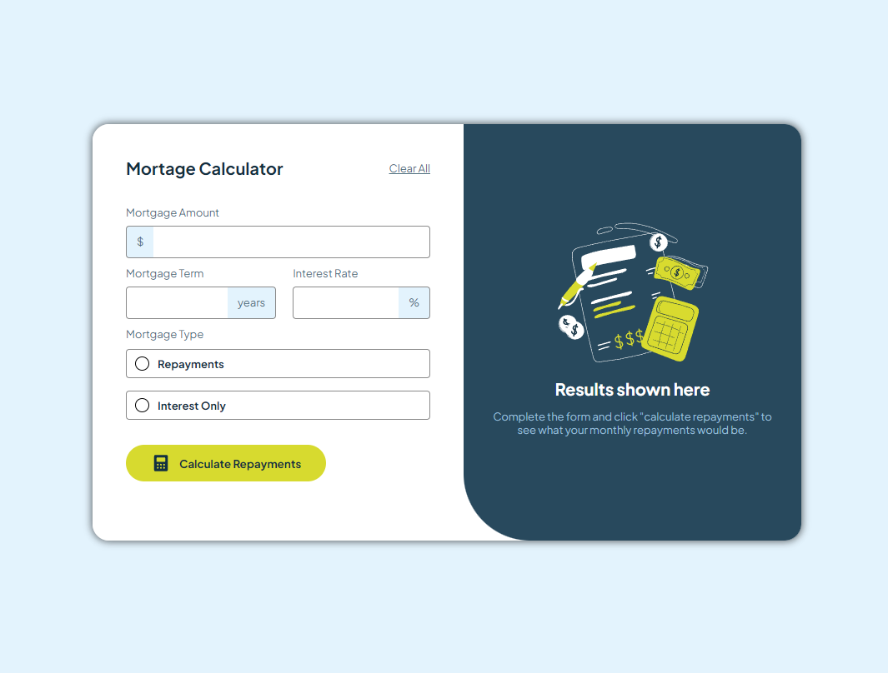

# 🏡 Mortgage Repayment Calculator

This is a solution to the [Frontend Mentor Challenge: Mortgage Repayment Calculator](https://www.frontendmentor.io/challenges/mortgage-repayment-calculator-Galx1LXK73). This project helps users easily calculate their mortgage repayments with just a few clicks, offering a user-friendly interface and responsive design for an optimal experience on any device.

## 📋 Table of Contents

- [Project Overview](#project-overview)
  - [Features](#features)
  - [Screenshots](#screenshots)
  - [Live Demo](#live-demo)
- [Development Process](#development-process)
  - [Technologies Used](#technologies-used)
  - [Key Challenges](#key-challenges)
  - [Learnings and Improvements](#learnings-and-improvements)
- [Installation and Usage](#installation-and-usage)
  - [Getting Started](#getting-started)
- [Contributing](#contributing)
- [Author](#author)
- [Acknowledgments](#acknowledgments)

## 📖 Project Overview

### Features

- **Interactive Form**: Users can input mortgage details such as amount, term, and interest rate.
- **Dynamic Results**: Instant calculation of monthly and total repayments based on user inputs.
- **Error Handling**: Clear feedback when required fields are left empty or invalid inputs are provided.
- **Responsive Design**: Seamless experience across desktop, tablet, and mobile devices.
- **Accessible Navigation**: The form can be completed using only the keyboard, with visible focus states.

### Screenshots

### Live Demo

Check out the live demo [here](https://aymendash.github.io/repayment-calculator/).

## 🔧 Development Process

### Technologies Used

- Semantic HTML5 markup
- CSS custom properties
- Flexbox & Grid for layout
- JavaScript for interactivity and DOM manipulation
- Mobile-first workflow

### Key Challenges

- Implementing accurate mortgage repayment calculations.
- Ensuring responsive design across various screen sizes.
- Providing user-friendly error handling and validation.

### Learnings and Improvements

This project reinforced my understanding of responsive design, form validation, and JavaScript calculations. In future projects, I aim to further refine these skills, especially in optimizing performance for large-scale applications.

## 🚀 Installation and Usage

### Getting Started

To run this project locally:

1. Clone the repo: `git clone https://github.com/AymenDaSh/repayment-calculator.git`
2. Navigate to the project directory: `cd repayment-calculator`
3. Open `index.html` in your browser to view the app.

## 🤝 Contributing

Contributions, issues, and feature requests are welcome! Feel free to check the [issues page](https://github.com/AymenDaSh/repayment-calculator/issues) or submit a pull request.

## 👤 Author

- Website - [Your Name](https://www.yourwebsite.com)
- Frontend Mentor - [@AymenDaSh](https://www.frontendmentor.io/profile/AymenDaSh)
- Twitter - [@yourusername](https://www.twitter.com/yourusername)

## 🙏 Acknowledgments

A big thanks to the Frontend Mentor community for providing this challenge and offering feedback on submitted solutions.
